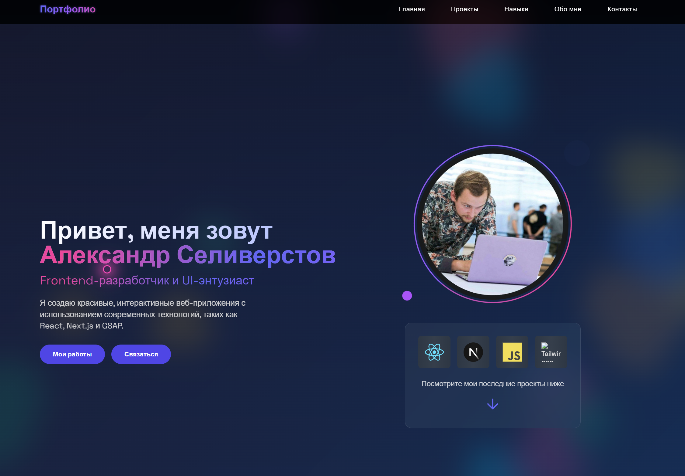
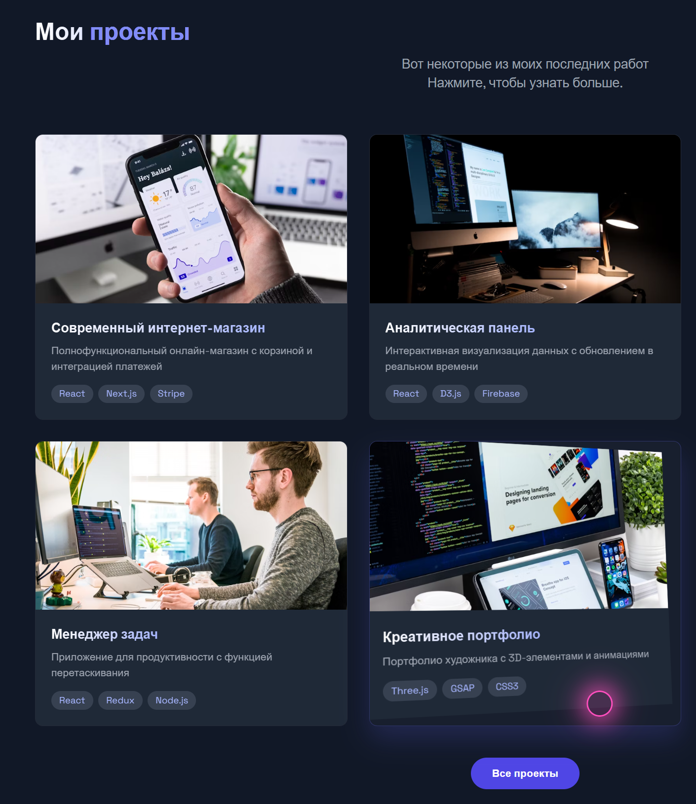

 

  

###

# Привет👋 Меня зовут Александр!

###

## Содержание
- [Обо мне](#обо-мне)
- [Технологии](#технологии)
- [Сайт-портфолио](#сайт-портфолио)
- [Избранные проекты](#избранные-проекты)
- [Моя статистика](#моя-статистика)
- [Как со мной связаться](#как-со-мной-связаться)

###

  
  
  

###

  

###

### 📖  Обо мне

Инженер с 10+ годами опыта управления сложными проектами, переквалифицировался во Frontend‑разработку.
Интересуюсь созданием удобных интерфейсов, качеством кода и оптимизацией производительности.
  
- 🔭 Делаю pet‑проекты и внедряю лучшие практики 
- 🧪 Применяю опыт QA для повышения надежности фронтенда 
- 📚 Сейчас углубляюсь в экосистему Vue 3 и Nuxt

###

  

###

### 👨‍💻 Технологии:

### Языки:

  
  
  
  
  
  
  

### Фреймворки:

  
  
  

### UI/Сборка:

  
  
  
  
  
  
  
  
  
  
  
  
  
  
  
  
  

### IDE/Редакторы:

  
  
  

### Прочие инструменты:

  
  
  
  
  
  
  
  
  
  
  
  
  
  
  
  
  

### Сейчас изучаю:

  
  
  
  
  

### Ближайшие цели:  

- 🚀 Pet‑проект на Nuxt.js: SSR/SSG, маршрутизация, Pinia‑стор, аутентификация, i18n; деплой на Vercel + простая CI.  
- 🧠 TypeScript: включить strict‑режим, прокачать generics/utility types, типизировать API и формы; рефакторинг ключевых компонентов на TS.  
- ✅ Тестирование: настроить Vitest + Vue Test Utils/RTL, добавить снепшоты и e2e (Playwright/Cypress), цель — покрытие 80%+.  

###

### 🌐 Сайт‑портфолио

   
  

  
<b>Скриншоты сайта</b> (развернуть)

   
  
    
  

### Как со мной связаться:

  
  
  
  
  
  

